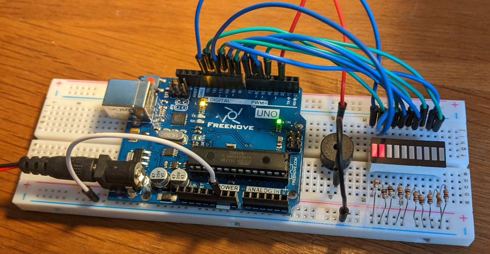

# git-whiner

> A node git watcher intended to nurture better practices and its arduino evil materialization to make them real.

## Scripts

`yarn dev`

`yarn build`

## arduino steps

-   [Arduino circuit demo in POC](https://github.com/antoinefricker/git-whiner/commit/f8ea6b7ccfd133c25d61acd39f4cd81b9e3d577e) (proof of concept)

